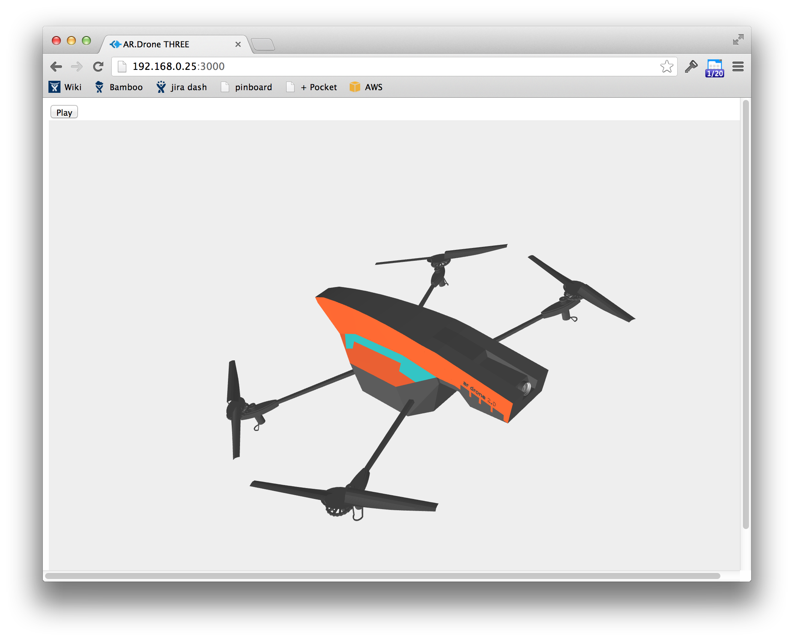

ardrone-browser-3d
==================

This is an in-browser 3D model of an AR.DRone that shows telemetry
live using three.js.

See a demo at http://wiseman.github.io/ardrone-browser-3d/




## Running

To run it with your drone, first do

```
npm install
```

Then connect to your drone's wifi and start the app:

```
node app.js
```

Now point your browser at http://localhost:3000/, pick up your drone
and make it dance.


## Just a simple hack

This is just a simple, ugly hack:

1. Take the ["ar drone 2.0 bleu" Sketchup
model](http://sketchup.google.com/3dwarehouse/details?mid=fb442457163fcdbed04e3327b51cff5c)
by tototech and tweak it a little.

2. Start with eschnou's
[ardrone-webflight](https://github.com/eschnou/ardrone-webflight) and
modify it a bit.  Really I just use it to get the navdata websocket,
but this entire project could be a plugin for `ardrone-webflight`.

3. Create a subclass of `THREE.Object3D` that knows how to transform
rotations from the AR.Drone frame of reference/coordinate system into
the three.js coordinate system:

```javascript
var Drone = function(model) {
  THREE.Object3D.call(this);
  this.add(model);
}
Drone.prototype = Object.create(THREE.Object3D.prototype);

var PI180 = Math.PI / 180.0;

Drone.prototype.updateState = function(navdata) {
  var euler = navdata.demo.rotation;
  var m = new THREE.Matrix4();
  // I couldn't find documentation on the AR.Drone Euler angle order,
  // but this seems to work.
  m.makeRotationFromEuler(new THREE.Vector3(euler.roll * PI180,
                                            euler.yaw * -PI180,
                                            euler.pitch * PI180),
                          'YZX');
  this.matrix = m;
  this.matrixAutoUpdate = false;
  this.updateMatrixWorld(true);
};
```
